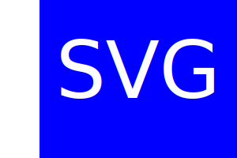
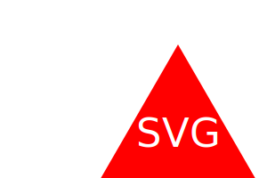

## SVG-Logo-Maker

  
   
  
  

## Description:
The description of a SVG Logo Maker is to create a SVG logo and save it as a SVG image file to make it easier as a developer to be their own graphic designer while using node.js, jest and inquirer.

## Table of Contents:
- [Description](#description)
- [Usage](#usage)
- [Links](#links)
- [Installation](#installation)
- [Mock-up](#mock-up)
- [Credits](#credits)
- [Contact me](#contact-me)

## Links
- [The URL of Github Repository](https://github.com/kathylopez97/SVG-Logo-Maker)
- [The URL OF the Deployed Application]()
- [Youtube Video Walkthrough](https://www.youtube.com/watch?v=TiIQPf6qsF4)
- [A sample SVG file generated using your application.](images/circle.logo.svg)
## Installation 
1. Clone the repository: [SVG-Logo-Maker](https://github.com/kathylopez97/SVG-Logo-Maker)
2. Install Node.JS " [Version 16.18.1](https://nodejs.org/en/blog/release/v16.18.1/)
3. Install Jest [Jest](https://www.npmjs.com/package/jest)
3. Open the cloned repository in a source code editor.
4. Open integrated terminal on index.js in order to run "npm i" on the command line to ensure that "node-modules" and "package.json" are operating on your local device.

## Usage
How to create SVG Logo Maker Instructions:
1. Open the cloned repository in a source code editor e.g. Visual Studio Code.
2. Open integrated terminal on index.js
3. Enter “node index.js” in the command line
4. Type "run test"to test the svg logo maker to see if all shapes passed.
- JavaScript
- Node.js
- Inquirer.js: [Version 8.2.4](https://www.npmjs.com/package/inquirer/v/8.2.4)
- Jest : [Jest](https://www.npmjs.com/package/jest)
- License Badge: [Shields.io](https://shields.io/)
## Mock-up

## Credits 
- Youtube: [Youtube](https://youtube.com)
- Visual Studio Code: [VS Code](https://code.visualstudio.com/)
- Professional  Video Guide Submisson: [VideoGuide](https://coding-boot-camp.github.io/full-stack/computer-literacy/video-submission-guide)

## Contact me
Contact me If you have any questions or additional feedback.
- [Github](https://github.com/kathylopez97)
- [Email](kathyylopezz97@gmail.com)
